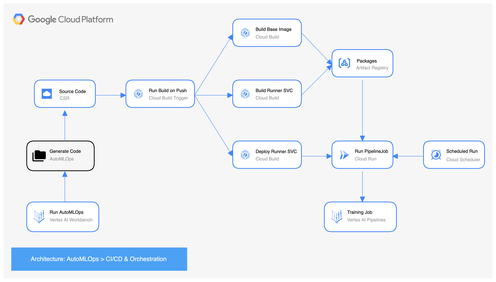

# AutoMLOps

AutoMLOps is a service that generates a production ready MLOps pipeline from Jupyter Notebooks, bridging the gap between Data Science and DevOps and accelerating the adoption and use of Vertex AI. The service generates an MLOps codebase for users to customize, and provides a way to build and manage a CI/CD integrated MLOps pipeline from the notebook. AutoMLOps automatically builds a source repo for versioning, cloudbuild configs and triggers, an artifact registry for storing custom components, gs buckets, service accounts and updated IAM privs for running pipelines, enables APIs (cloud Run, Cloud Build, Artifact Registry, etc.), creates a runner service API in Cloud Run for submitting PipelineJobs to Vertex AI, and a Cloud Scheduler job for submitting PipelineJobs on a recurring basis. These automatic integrations empower data scientists to take their experiments to production more quickly, allowing them to focus on what they do best: providing actionable insights through data.

# Prerequisites

In order to use AutoMLOps, the following are required:

- Python 3.7 - 3.10
- [Google Cloud SDK 407.0.0](https://cloud.google.com/sdk/gcloud/reference)
- [beta 2022.10.21](https://cloud.google.com/sdk/gcloud/reference/beta)
- `git` installed
- `git` logged-in:
```
  git config --global user.email "you@example.com"
  git config --global user.name "Your Name"
```
- [Application Default Credentials (ADC)](https://cloud.google.com/docs/authentication/provide-credentials-adc) are setup. This can be done through the following commands:
```
gcloud auth application-default login
gcloud config set account <account@example.com>
```

AutoMLOps generates code that is compatible with `kfp<2.0.0`.

# Install

Install AutoMLOps from [PyPI](https://pypi.org/project/google-cloud-automlops/): `pip install google-cloud-automlops` 

Or Install locally by cloning the repo and running `pip install .`

# Dependencies
- `docopt==0.6.2`,
- `docstring-parser==0.15`,
- `pipreqs==0.4.11`,
- `PyYAML==6.0.1`,
- `yarg==0.1.9`

# GCP Services
AutoMLOps makes use of the following products by default:
- [Vertex AI Pipelines](https://cloud.google.com/vertex-ai/docs/pipelines/introduction)
- [Artifact Registry](https://cloud.google.com/artifact-registry/docs/overview)
- [Google Cloud Storage](https://cloud.google.com/storage/docs/introduction)
- [Cloud Build](https://cloud.google.com/build/docs/overview)
- [Cloud Build Triggers](https://cloud.google.com/build/docs/triggers)
- [Cloud Run](https://cloud.google.com/run/docs/overview/what-is-cloud-run)
- [Cloud Scheduler](https://cloud.google.com/scheduler/docs/overview)
- [Cloud Tasks](https://cloud.google.com/tasks/docs)

# APIs & IAM
AutoMLOps will enable the following APIs:
- [cloudresourcemanager.googleapis.com](https://cloud.google.com/resource-manager/reference/rest)
- [aiplatform.googleapis.com](https://cloud.google.com/vertex-ai/docs/reference/rest)
- [artifactregistry.googleapis.com](https://cloud.google.com/artifact-registry/docs/reference/rest)
- [cloudbuild.googleapis.com](https://cloud.google.com/build/docs/api/reference/rest)
- [cloudscheduler.googleapis.com](https://cloud.google.com/scheduler/docs/reference/rest)
- [cloudtasks.googleapis.com](https://cloud.google.com/tasks/docs/reference/rest)
- [compute.googleapis.com](https://cloud.google.com/compute/docs/reference/rest/v1)
- [iam.googleapis.com](https://cloud.google.com/iam/docs/reference/rest)
- [iamcredentials.googleapis.com](https://cloud.google.com/iam/docs/reference/credentials/rest)
- [ml.googleapis.com](https://cloud.google.com/ai-platform/training/docs/reference/rest)
- [run.googleapis.com](https://cloud.google.com/run/docs/reference/rest)
- [storage.googleapis.com](https://cloud.google.com/storage/docs/apis)
- [sourcerepo.googleapis.com](https://cloud.google.com/source-repositories/docs/reference/rest)

AutoMLOps will update [IAM privileges](https://cloud.google.com/iam/docs/understanding-roles) for the following accounts:
1. Pipeline Runner Service Account (one is created if it does exist, defaults to: vertex-pipelines@PROJECT_ID.iam.gserviceaccount.com). Roles added:
- roles/aiplatform.user
- roles/artifactregistry.reader
- roles/bigquery.user
- roles/bigquery.dataEditor
- roles/iam.serviceAccountUser
- roles/storage.admin
- roles/run.admin
2. Cloudbuild Default Service Account (PROJECT_NUMBER@cloudbuild.gserviceaccount.com). Roles added:
- roles/run.admin
- roles/iam.serviceAccountUser
- roles/cloudtasks.enqueuer
- roles/cloudscheduler.admin

# User Guide

For a user-guide, please view these [slides](./AutoMLOps_Implementation_Guide_External.pdf).

# List of Examples

Training
- [00_introduction_training_example](./examples/training/00_introduction_training_example.ipynb)
- [00_introduction_training_example_no_notebook](./examples/training/00_introduction_training_example_no_notebook.py)
- [01_clustering_example](./examples/training/01_clustering_example.ipynb)
- [02_tensorflow_transfer_learning_gpu_example](./examples/training/02_tensorflow_transfer_learning_gpu_example.ipynb)
- [03_bqml_introduction_training_example](./examples/training/03_bqml_introduction_training_example.ipynb)
- [04_bqml_forecasting-retail-demand](./examples/training/04_bqml_forecasting-retail-demand.ipynb)

Inferencing
- [00_batch_prediction_example](./examples/inferencing/00_batch_prediction_example.ipynb)
- [01_customer_churn_model_monitoring_example](./examples/inferencing/01_customer_churn_model_monitoring_example.ipynb)

# Options

AutoMLOps CI/CD options:
1. `run_local`: Bool that specifies whether to use generate files resources locally or use cloud CI/CD workflow (see below). Defaults to True. See [CI/CD Workflow](#cloud-continuous-integration-and-continuous-deployment-workflow)

Required parameters:
1. `project_id: str`
2. `pipeline_params: dict`

Optional parameters (defaults shown):
1. `af_registry_location: str = 'us-central1'`
2. `af_registry_name: str = 'vertex-mlops-af'`
3. `base_image: str = 'python:3.9-slim'`
4. `cb_trigger_location: str = 'us-central1'`
5. `cb_trigger_name: str = 'automlops-trigger'`
6. `cloud_run_location: str = 'us-central1'`
7. `cloud_run_name: str = 'run-pipeline'`
8. `cloud_tasks_queue_location: str = 'us-central1'`
9. `cloud_tasks_queue_name: str = 'queueing-svc'`
10. `csr_branch_name: str = 'automlops'`
11. `csr_name: str = 'AutoMLOps-repo'`
12. `custom_training_job_specs: list[dict] = None`
13. `gs_bucket_location: str = 'us-central1'`
14. `gs_bucket_name: str = None`
15. `pipeline_runner_sa: str = None`
16. `run_local: bool = True`
17. `schedule_location: str = 'us-central1'`
18. `schedule_name: str = 'AutoMLOps-schedule'`
19. `schedule_pattern: str = 'No Schedule Specified'`
20. `vpc_connector: str = None`

AutoMLOps will generate the resources specified by these parameters (e.g. Artifact Registry, Cloud Source Repo, etc.). If run_local is set to False, the AutoMLOps will turn the current working directory of the notebook into a Git repo and use it for the CSR. Additionally, if a cron formatted str is given as an arg for `schedule_pattern` then it will set up a Cloud Schedule to run accordingly.

# Customizations

**Set scheduled run:**

Use the `schedule_pattern` parameter to specify a cron job schedule to run the pipeline job on a recurring basis.
```
schedule_pattern = '0 */12 * * *'
```

**Set pipeline compute resources:**

Use the `base_image` and `custom_training_job_specs` parameter to specify resources for any custom component in the pipeline.
```
base_image = 'us-docker.pkg.dev/vertex-ai/training/tf-gpu.2-11.py310:latest',
custom_training_job_specs = [{
    'component_spec': 'train_model',
    'display_name': 'train-model-accelerated',
    'machine_type': 'a2-highgpu-1g',
    'accelerator_type': 'NVIDIA_TESLA_A100',
    'accelerator_count': '1'
}]
```

**Use a VPC connector:**

Use the `vpc_connector` parameter to specify a vpc connector. 
```
vpc_connector = 'example-vpc'
```

**Specify package versions:**

Use the `packages_to_install` parameter of `@AutoMLOps.component` to explicitly specify packages and versions. 
```
@AutoMLOps.component(
    packages_to_install=[
        "google-cloud-bigquery==2.34.4", 
        "pandas",
        "pyarrow",
        "db_dtypes"
    ]
)
def create_dataset(
    bq_table: str,
    data_path: str,
    project_id: str
):
...
```

# Layout

Included in the repository is an [example notebook](./examples/training/00_training_example.ipynb) that demonstrates the usage of AutoMLOps. Upon running `AutoMLOps.go(project_id='automlops-sandbox',pipeline_params=pipeline_params)`, a series of directories will be generated automatically, and a pipelineJob will be submitted using the setup below:

```bash
.
├── cloud_run                                      : Cloud Runner service for submitting PipelineJobs.
    ├──run_pipeline                                : Contains main.py file, Dockerfile and requirements.txt
    ├──queueing_svc                                : Contains files for scheduling and queueing jobs to runner service
├── components                                     : Custom vertex pipeline components.
    ├──component_base                              : Contains all the python files, Dockerfile and requirements.txt
    ├──create_dataset                              : Pull data from a BQ table and writes it as a csv to GS.
    ├──train_model                                 : Trains a basic decision tree classifier.
    ├──deploy_model                                : Deploys model to endpoint.
├── images                                         : Custom container images for training models.
├── pipelines                                      : Vertex ai pipeline definitions.
    ├── pipeline.py                                : Full pipeline definition.
    ├── pipeline_runner.py                         : Sends a PipelineJob to Vertex AI.
    ├── runtime_parameters                         : Variables to be used in a PipelineJob.
        ├── pipeline_parameter_values.json         : Json containing pipeline parameters.    
├── configs                                        : Configurations for defining vertex ai pipeline.
    ├── defaults.yaml                              : PipelineJob configuration variables.
├── scripts                                        : Scripts for manually triggering the cloud run service.
    ├── build_components.sh                        : Submits a Cloud Build job that builds and deploys the components.
    ├── build_pipeline_spec.sh                     : Builds the pipeline specs
    ├── create_resources.sh                        : Creates an artifact registry and gs bucket if they do not already exist.
    ├── run_pipeline.sh                            : Submit the PipelineJob to Vertex AI.
    ├── run_all.sh                                 : Builds components, pipeline specs, and submits the PipelineJob.
└── cloudbuild.yaml                                : Cloudbuild configuration file for building custom components.
```

# Cloud Continuous Integration and Continuous Deployment Workflow
If `run_local=False`, AutoMLOps will generate and use a fully featured CI/CD environment for the pipeline. Otherwise, it will use the local scripts to build and run the pipeline.

<p align="center">
    
</p>

# Pipeline Components

The [example notebook](./examples/training/00_training_example.ipynb) comes with 3 components as part of the pipeline. Additional sample code for commonly used services can be found below:

- [Feature Store](https://github.com/GoogleCloudPlatform/vertex-ai-samples/tree/main/notebooks/official/feature_store)
- [BigQuery ML](https://github.com/GoogleCloudPlatform/vertex-ai-samples/tree/main/notebooks/official/bigquery_ml)
- [Model Registry](https://github.com/GoogleCloudPlatform/vertex-ai-samples/tree/main/notebooks/official/model_registry)
- [Experiments](https://github.com/GoogleCloudPlatform/vertex-ai-samples/tree/main/notebooks/official/experiments)
- [ExplainableAI](https://github.com/GoogleCloudPlatform/vertex-ai-samples/tree/main/notebooks/official/explainable_ai)
- [Vertex AI Pipelines](https://cloud.google.com/vertex-ai/docs/pipelines/notebooks)
- [Google Cloud Pipeline Components](https://github.com/GoogleCloudPlatform/vertex-ai-samples/blob/main/notebooks/official/pipelines/custom_model_training_and_batch_prediction.ipynb)

# Next Steps / Backlog
- Use [terraform](https://github.com/GoogleCloudPlatform/vertex-pipelines-end-to-end-samples/tree/main/terraform) for the creation of resources.
- Allow multiple AutoMLOps pipelines within the same directory
- Alternatives to Pipreqs

# Contributors

[Sean Rastatter](mailto:srastatter@google.com): Tech Lead

[Tony DiLoreto](mailto:tonydiloreto@google.com): Project Manager

[Allegra Noto](mailto:allegranoto@google.com): Senior Project Engineer

[Ahmad Khan](mailto:ahmadkh@google.com): Engineer

[Jesus Orozco](mailto:jesusfc@google.com): Cloud Engineer

[Erin Horning](mailto:ehorning@google.com): Infrastructure Engineer

[Alex Ho](mailto:alexanderho@google.com): Engineer

[Kyle Sorensen](mailto:kylesorensen@google.com): Cloud Engineer

# Disclaimer

**This is not an officially supported Google product.**

Copyright 2023 Google LLC. All Rights Reserved.

Licensed under the Apache License, Version 2.0 (the "License");
you may not use this file except in compliance with the License.
You may obtain a copy of the License at

http://www.apache.org/licenses/LICENSE-2.0

Unless required by applicable law or agreed to in writing, software
distributed under the License is distributed on an "AS IS" BASIS,
WITHOUT WARRANTIES OR CONDITIONS OF ANY KIND, either express or implied.
See the License for the specific language governing permissions and
limitations under the License.
