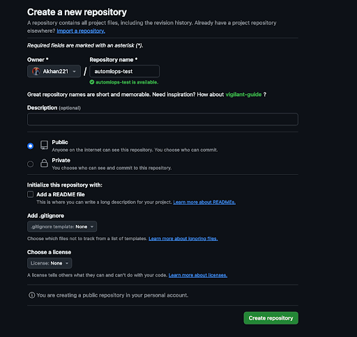
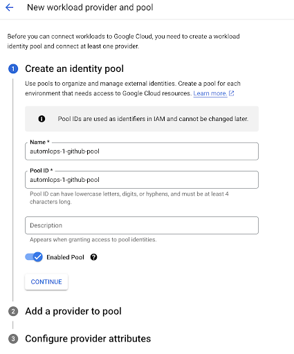
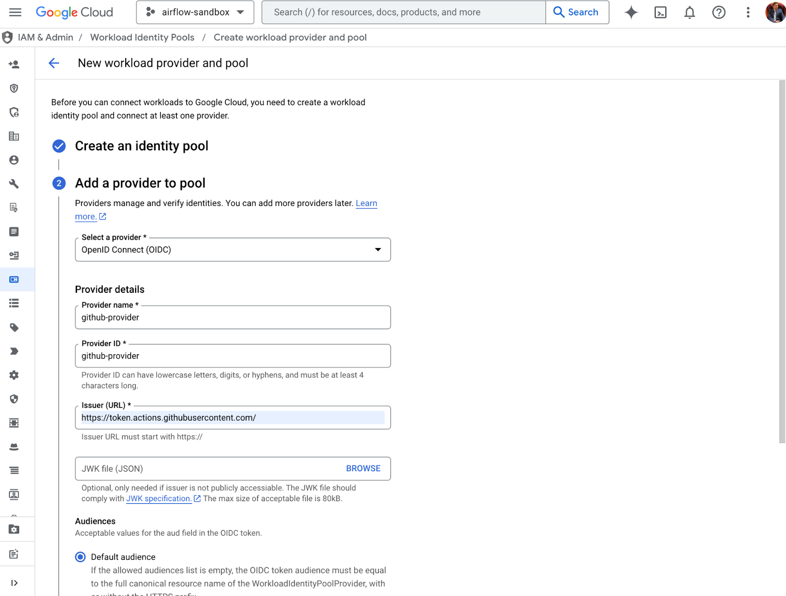
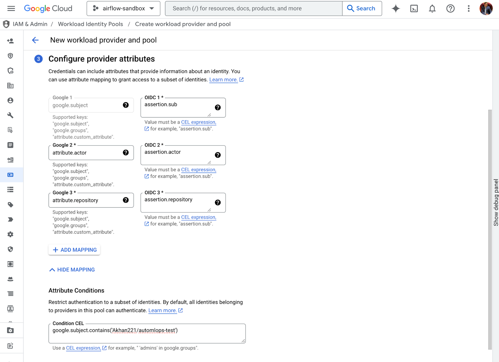
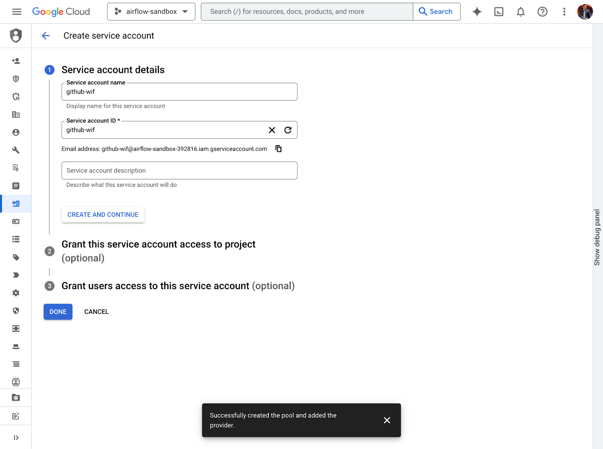
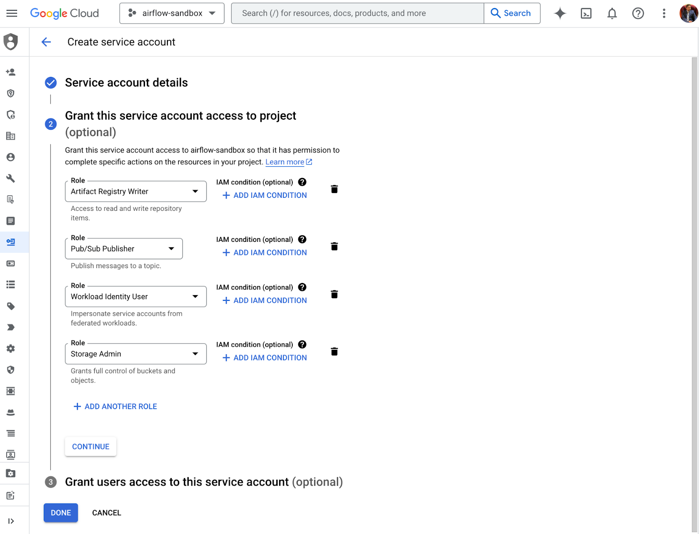

**Using Github With AMO**

The steps below are required in order to deploy a model using the AutoMLOps package. The process below assumes that the [AutoMLOps](https://github.com/GoogleCloudPlatform/automlops) package is already installed in the environment where the AutoMLOps execution cells are being run.

## **Create a Repository**

Go to Github, and create a new repository leaving fields as default. Let’s call it automlops-test.

<p align="left">
    
</p>

\[Optional\] Create repository via Terraform

```
resource "github_repository" "my_repo" {
  name        = "my_cool_repo"
  description = "My awesome codebase"
  visibility  = "private"
}
```

## **Set up SSH connection**

Follow [this guide](https://docs.github.com/en/authentication/connecting-to-github-with-ssh) on how to add your SSH keys to the environment from where you are running the AutoMLOps commands.

## **Pre-requisites**

Ensure that you have the following IAM Roles to provision an Identity Pool:

* roles/iam.workloadIdentityPoolAdmin

**Set up [Workload Identity Federation](https://cloud.google.com/iam/docs/workload-identity-federation) (WIF) for GitHub Actions**

1. Create an Identity Pool in GCP  
<p align="left">
    
</p>
- Enter a pool name and click ‘Continue’. Example details:  
  - Name: automlops-1-github-pool  
  - Pool ID: automlops-1-github-pool  
  - \<check Enabled pool\>

2. Create an Identity Provider and add it to the pool:

<p align="left">
    
</p>

<p align="left">
    
</p>

- Fill in the attributes and conditions for the provider with the following details:

  - #### Provider type: OpenID Connect (OIDC)

  - Provider Name: automlops-github-provider  
  - Provider ID: automlops-github-provider  
  - Issuer (URL): https://token.actions.githubusercontent.com/  
  - JWK file (JSON): \<leave empty\>  
  - Audiences: \<select Default audience\>  
  - Attribute Mappings:  
    - Google 1: google.subject  
    - OIDC 1: assertion.sub  
    - Google 2: attribute.actor  
    - OIDC 2: assertion.actor  
    - Google 3: attribute.repository  
    - OIDC 3: assertion.repository  
  - Attribute Conditions: google.subject.contains("\<my\_repo\_name\>")  
    - i.e. google.subject.contains("Akhan221/automlops-test")


3. Create a service account  
   Go to the service accounts tab and click on new service account in the top right. Provide a unique name for the service account (SA).

<p align="left">
    
</p>

   \[Optional\] Create the Service Account using Terraform

	

```
resource "google_service_account" "service_account" {
  account_id   = "service-account-id"
  display_name = "Service Account"
}
```

4. Grant necessary permission to the Service Account  
   1. *roles/artifactregistry.writer*  
   2. *roles/pubsub.publisher*  
   3. *roles/iam.workloadIdentityUser*  
   4. *roles/storage.admin*

<p align="left">
    
</p>

5. Grant identity pool access to the SA, following the instructions at [this link](https://cloud.google.com/iam/docs/workload-download-cred-and-grant-access?_gl=1*1qn8wpp*_ga*MTU3MjE2NjAzMy4xNzA2NzI1NDU0*_ga_WH2QY8WWF5*MTczMDM4MzY1MC41OS4xLjE3MzAzODQ2NTUuNjAuMC4w#service-account-in-the-same-project).  
   1. Option 1  
      1. Select “+ Grant Access” at the top of the Identity Pool view  
      2. Check “Grant access using Service Account impersonation”  
      3. Select the service account you just created  
      4. For the attribute name, select “repository”  
      5. For the attribute value, write full name of your repo e.g. “Akhan221/automlops-test”  
      6. Click Save  
   2. Option 2  
      1. Navigate to IAM \-\> Service Accounts, select the desired service account from the list  
      2. Select “Permissions” from the top menu  
      3. Select “+ Grant Access”  
      4. Add the principal that aligns to the Identity Pool  
         1. principalSet://iam.googleapis.com/projects/PROJECT\_NUMBER/locations/global/workloadIdentityPools/POOL\_ID/attribute.repository/FULL\_REPO\_STRING  
   3. Option 3 (grant full access to the pool)  
      1. Run the following command:

         gcloud iam service-accounts add-iam-policy-binding "FULL\_SERVICE\_ACCOUNT\_STRING" \\

           \--project="PROJECT\_ID" \\

           \--role="roles/iam.workloadIdentityUser" \\

          \--member=principalSet://iam.googleapis.com/projects/PROJECT\_NUMBER/locations/global/workloadIdentityPools/POOL\_ID/\*

## **Run the Generate Step with the WIF Details**

When going through the AutoMLOps example notebook, on the generate step make sure to include these fields along with the other required parameters: 

```py
AutoMLOps.generate(
   ...
   use_ci=True,
   deployment_framework='github-actions',
   project_number='<project_number>', # ie. 99800000432
   source_repo_type='github',
   source_repo_name='source/repo/string', # ie. Akhan221/automlops-test            
   workload_identity_pool='identity_pool_string',           # ID string
   workload_identity_provider='identity_provider_string',   # ID string            
   workload_identity_service_account='workload_identity_sa' # full SA string
)
```

For the source\_repo\_name, note that this is referring to the full name of the repo including the owner prefix. For example, Akhan221/my-test-repo.

## **Run the provision and deploy steps**

Finish running the remainder of the commands and verify that the pipeline actually gets created in Vertex AI.
